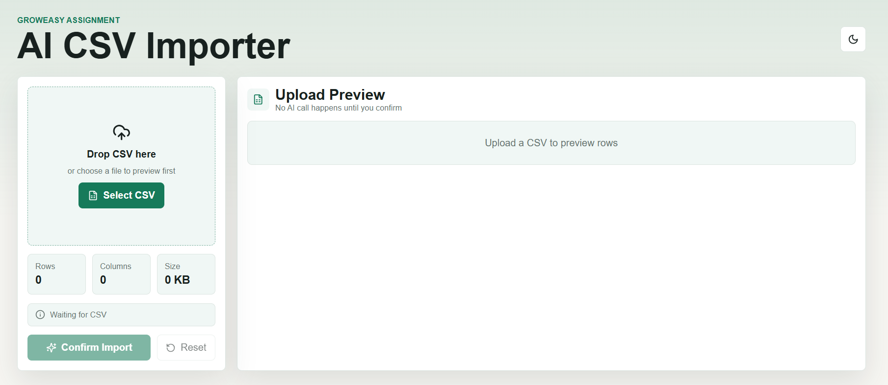
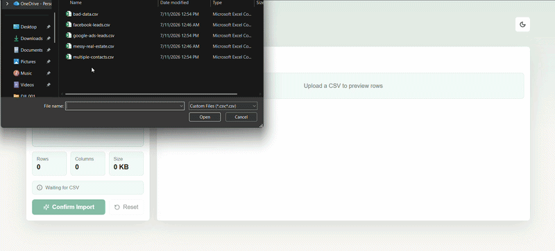
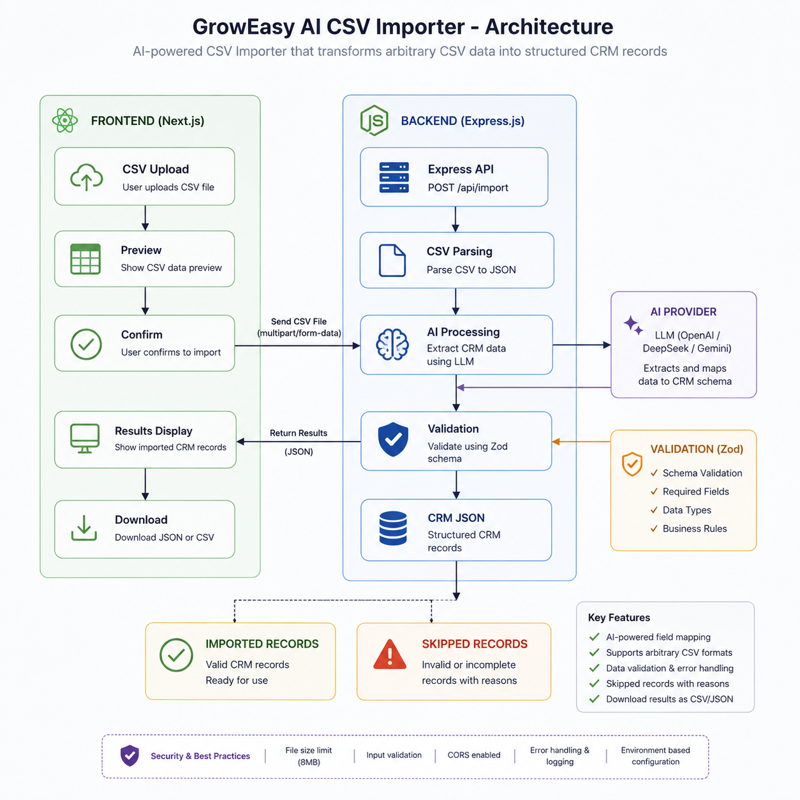
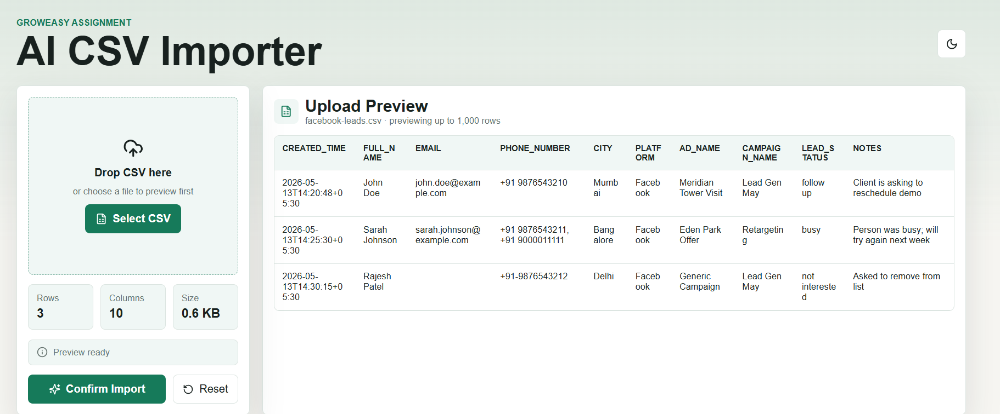
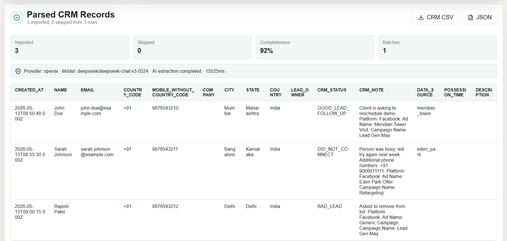
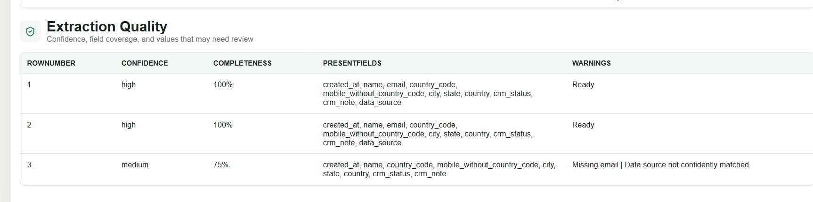

# GrowEasy AI CSV Importer

AI-powered CSV importer for mapping arbitrary lead exports into a GrowEasy CRM-ready schema.





## Table of Contents

- [Overview](#overview)
- [Features](#features)
- [Architecture](#architecture)
- [Screenshots](#screenshots)
- [How it Works](#how-it-works)
- [Getting Started](#getting-started)
- [Environment Variables](#environment-variables)
- [API](#api)
- [Sample Data](#sample-data)
- [Docker](#docker)
- [Scripts](#scripts)
- [Deployment](#deployment)
- [Supported CRM Schema](#supported-crm-schema)

## Overview

This repository contains a monorepo with:

- `apps/web` — Next.js frontend for CSV preview, confirmation, and result downloads.
- `apps/api` — TypeScript Express backend that parses CSV, dispatches AI extraction, validates results, and returns normalized CRM records.
- `packages/shared` — shared types and CRM constants used by both frontend and backend.

The app is designed to accept messy lead exports from Facebook, Google Ads, real estate CRMs, agencies, and manual spreadsheets.

## Features

- Local CSV preview before any backend processing
- Drag-and-drop upload and file picker UI
- Confirm-before-processing workflow
- AI-assisted schema mapping for arbitrary column names
- Strict JSON extraction prompt + Zod validation
- Built-in fallback extractor for offline or quota-safe operation
- Batch processing with retry logic and provider fallback
- Download parsed CRM records as CSV or JSON
- Import metadata: provider, model, fallback usage, batch count, processing time, and completeness score
- Skips rows missing both email and mobile
- Extra emails/mobiles and ambiguous details are preserved in `crm_note`
- Sample datasets for testing edge cases

## Architecture



- `apps/web` — Next.js 15 frontend, client-side CSV preview via PapaParse, backend import form submission
- `apps/api` — Express + TypeScript API, CSV parsing with PapaParse, AI provider abstraction, output normalization
- `packages/shared` — CRM field list, status/source enums, shared TypeScript types

## Screenshots

### CSV Preview



### Parsed Results





## How it Works

1. User uploads a CSV file in the browser.
2. Frontend parses and previews rows locally.
3. User confirms import.
4. Frontend sends the raw CSV to `/api/import`.
5. Backend parses the CSV rows and sends them to AI in batches.
6. AI returns structured CRM records or skipped rows.
7. Backend normalizes values, validates schema, and returns final results.
8. Frontend displays parsed records, quality metrics, skipped rows, and download buttons.

## Getting Started

### Prerequisites

- Node.js 20+ (or compatible)
- npm

### Install dependencies

```bash
npm install
```

### Start development servers

```bash
npm run dev
```

This starts both the frontend and backend using npm workspaces:

- Frontend: `http://localhost:3000`
- Backend: `http://localhost:4000`

### Health check

```bash
curl http://localhost:4000/health
```

## Environment Variables

Copy the example env file:

```bash
copy .env.example .env
```

Common configuration:

```env
NEXT_PUBLIC_API_URL=http://localhost:4000
PORT=4000
CLIENT_ORIGIN=http://localhost:3000
AI_PROVIDER=mock
AI_FALLBACK_ON_ERROR=true
```

### AI provider examples

#### Local mock mode

```env
AI_PROVIDER=mock
```

#### OpenAI / OpenRouter

```env
AI_PROVIDER=openai
OPENAI_API_KEY=your_openai_key
OPENAI_BASE_URL=https://openrouter.ai/api/v1 # optional for OpenRouter
OPENAI_MODEL=gpt-4o-mini
OPENAI_MAX_TOKENS=4096
```

#### Gemini

```env
AI_PROVIDER=gemini
GEMINI_API_KEY=your_gemini_key
GEMINI_MODEL=gemini-flash-latest
GEMINI_FALLBACK_MODEL=gemini-3.5-flash
```

#### Claude / Anthropic

```env
AI_PROVIDER=anthropic
ANTHROPIC_API_KEY=your_anthropic_key
ANTHROPIC_MODEL=claude-3-5-haiku-latest
```

## API

### `GET /health`

Returns the API health status and current provider settings.

### `POST /api/import`

Accepts a single CSV file as multipart form data.

Request body:

- `file` — CSV file upload

Response payload:

- `records` — parsed GrowEasy CRM records
- `quality` — per-row quality metrics and warnings
- `skipped` — rows that could not be imported with reason and original data
- `summary` — totals for rows, imported records, skipped rows, and average completeness
- `meta` — runtime metadata including provider, model, fallback usage, batch count, and processing time

## Sample Data

Use these sample files to test import behavior:

- `samples/facebook-leads.csv`
- `samples/google-ads-leads.csv`
- `samples/messy-real-estate.csv`
- `samples/multiple-contacts.csv`
- `samples/bad-data.csv`

## Docker

Start both services with Docker Compose:

```bash
docker compose up --build
```

## Scripts

- `npm run dev` — start development mode for frontend + backend
- `npm run build` — build `packages/shared`, `apps/api`, and `apps/web`
- `npm run test` — run backend tests via Vitest
- `npm run lint` — lint frontend and backend

## Deployment

Recommended deployment flow:

- Deploy `apps/web` to Vercel or any Next.js host
- Deploy `apps/api` to Render, Railway, Fly.io, or similar
- Set `NEXT_PUBLIC_API_URL` in frontend deployment to the API URL
- Set `CLIENT_ORIGIN` in backend deployment to the frontend URL

## Supported CRM Schema

The importer normalizes output into the following GrowEasy CRM fields:

- `created_at`
- `name`
- `email`
- `country_code`
- `mobile_without_country_code`
- `company`
- `city`
- `state`
- `country`
- `lead_owner`
- `crm_status`
- `crm_note`
- `data_source`
- `possession_time`
- `description`

### Allowed status values

- `GOOD_LEAD_FOLLOW_UP`
- `DID_NOT_CONNECT`
- `BAD_LEAD`
- `SALE_DONE`

### Allowed data source values

- `leads_on_demand`
- `meridian_tower`
- `eden_park`
- `varah_swamy`
- `sarjapur_plots`

## Notes

- The frontend previews CSV rows locally and only calls the backend after the user confirms the import.
- The backend includes a fallback extractor so the app can run without a live AI provider.
- The import pipeline validates and normalizes phone numbers, dates, locations, and CRM metadata.
- Keep `AI_FALLBACK_ON_ERROR=true` for demos and unreliable free-tier AI quotas.
- Use provider billing or a paid model route for production reliability.
- The app is stateless and does not require a database.
- The importer caps file size to 8 MB and previews up to 1,000 rows in the browser.

## Assignment Context

This submission is built for the GrowEasy Software Developer assignment.

- Role: **Software Developer Intern / Full-Time**
- Company: **GrowEasy**
- Website: https://groweasy.ai
- Work mode: **Remote / WFH**
- Joining: **Immediate**
- Delivery: GitHub repo + hosted application URL

### Key project fit

- Intelligent CSV field mapping using AI
- Responsive frontend with preview + confirm workflow
- Robust backend with batch AI extraction, validation, and fallback handling
- Docker support and clean monorepo architecture

## Position Applied For

Software Developer Full-Time
